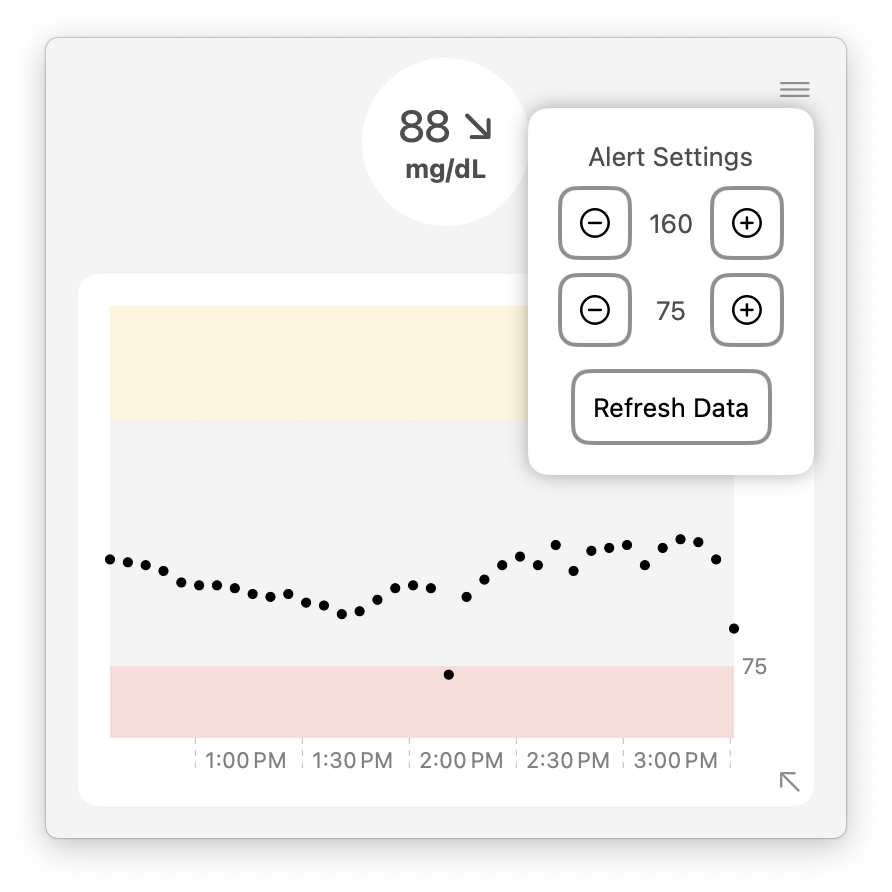

# dexcomMacDisplay 
A macOS Dexcom display, with menu bar setup, graphical display of 3hrs of readings, and customizable high and low alerts.
_______________
# Setup
Below is the walkthrough to setup the macOS Dexcom display on your machine. 

## Python 3
The dexcomMacDisplay script requires the use of python3. Follow the below steps to ensure proper setup and find the path to the Python executable. 

### Install Python 3
1. Visit the [Python Downloads](https://www.python.org/downloads/) page.
2. Download the latest version of Python 3 for Windows.
3. Follow the installation instructions provided during the installation process.

### Verify Installation
After installation and finding the path, open a terminal and run the following command to verify that Python 3 is installed:

```bash
python3 --version
```

### Find the Path to Python 3
To configure the project, you'll need to know the path to Python 3 on your machine. Here's how you can find it:

- **Windows:**
  - Open a Command Prompt.
  - Type `where python` and press Enter. Look for the path to the Python executable.

- **macOS and Linux:**
  - Open a terminal.
  - Type `which python3` and press Enter. Look for the path to the Python executable.
 
## File Path Configuration
Now with the location of your Python executable, the project needs access to your file paths.

- Open `PythonConfigTemplate.swift`.
- Replace the placeholder paths with the actual paths on your system.
  - Change the variable `pythonPath` to the path you found above to you Python executable. The full path should end with `/python3`.
  - Change the variable `projectPath` to the location of this project file (ex. `/Users/User1/Downloads/`)
- Save the file as `PythonConfig.swift`.

## Pydexcom Install and Setup
This project uses the pydexcom API to pull your dexcom readings. 

Follow along with the creator's steps to install pydexcom on your machine and setup your Dexcom account for sharing. 
>> https://github.com/gagebenne/pydexcom

Most importantly, follow the first two steps to get pydexcom installed and your Dexcom sharing configured. 
1. Download the Dexcom G6 / G5 / G4 mobile app and enable the Share service.
  The Dexcom Share service requires setup of at least one follower to enable the share service, but pydexcom will use your credentials, not the follower's
2. Install the pydexcom package.
   `pip3 install pydexcom`

## Setting Up Dexcom Credentials
To use this project, you'll need to set up your own Dexcom credentials. Follow these steps:

1. Open the `credentials_template.json` file located in the project directory.
2. Replace the placeholders with your Dexcom username and password.
3. Save the file as `credentials.json`.
4. Now you're ready to run the project with your own credentials.

**NOTE:** These credentials must be YOUR DEXCOM ACCOUNT credentials, not a follower of the account. See the pydexcom documentation for more information.

# Feature Walkthrough
When the app is running on your mac, the code automatically fetches data every 5 minutes to stay up to date with your Dexcom's status. 
The high and low alert boundaries are edited for the below images to trigger alerts for example purposes. The behavior will appropriately follow your specified bounds. 

## Menu Bar Icon
 

The current Dexcom reading and trend arrow displays in your menu bar, along with alerts for high and low values based on your specified bounds. 


## Graph View
In the menu bar window, the current reading and trend is shown above your historical data. The graph can be collapsed or expanded, showing 1 hour and 3 hours of data. 
<p align="center">
  
  
</p>

The top corner settings allow you to adjust your high and low alert settings and to force refresh the data before the timer. The color of the window will also change color according to the current alert. 

<p align="center">
  
  
  
</p>

Note the boundaries in the examples above that trigger the alerts.

## App Badge
Lastly, the badge on the app icon will also display high and low alerts if the current reading is outside of the specified bounds. 

<p align="center">
  
  
</p>
